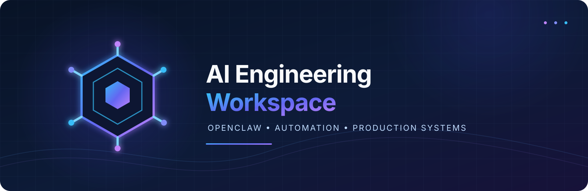
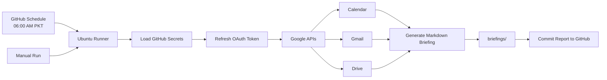

<p align="center">
  
</p>

<h1 align="center">AI Employee Workspace Automation</h1>

<p align="center">
  A professional, read-only Google Workspace briefing automation powered by GitHub Actions and OpenClaw.
</p>

<p align="center">
  <a href="LICENSE"></a>
  <a href="https://github.com/khanzadigithubid/ai-employee-workspace-public"></a>
  <a href="https://github.com/khanzadigithubid/ai-employee-workspace-public/actions/workflows/briefing.yml"></a>
  <a href="https://openclaw.ai/"></a>
</p>

## Purpose

This repository provides a clean public reference implementation for generating executive briefings from Google Workspace. It is designed to demonstrate secure automation, read-only API access, GitHub Actions scheduling, and professional Markdown reporting.

Personal OpenClaw configuration, memory, OAuth files, local schedules, and private Workspace data are intentionally excluded from this public repository.

## Repository Structure

```text
assets/                              # Public repository branding assets
automation/google_workspace_briefing.py # Read-only Google Workspace briefing script
automation/README.md                 # Automation setup and security guide
automation/requirements.txt          # Python dependencies
.github/workflows/briefing.yml       # Scheduled GitHub Actions workflow
README.md                            # Project and automation documentation
CHANGELOG.md                         # Version history
CONTRIBUTING.md                      # Contribution guidelines
LICENSE                              # MIT License
```

## Google Workspace Briefing Workflow

The **Google Workspace Briefing Workflow** is a read-only integration that consolidates key productivity data from Google Workspace into a single executive Markdown briefing.

### Current Status

- **Automation:** Enabled through GitHub Actions
- **Schedule:** Daily at **06:00 AM Pakistan Standard Time (PKT)**
- **Manual execution:** Available through **Actions -> Generate Public Executive Briefing -> Run workflow**
- **Output:** `briefings/briefing-YYYY-MM-DD.md`
- **Runtime:** Python 3.12 on GitHub-hosted Ubuntu
- **Google permissions:** Calendar, Gmail, and Drive **read-only** scopes

### How the Workflow Works

Every day at 06:00 AM PKT, GitHub starts a temporary Ubuntu runner, checks out the project code, loads encrypted repository secrets, reads fresh metadata from the Google APIs, generates a Markdown briefing, and commits the report to the `main` branch.



### Automatic Flow

1. GitHub Actions starts the scheduled or manual workflow.
2. A clean Python 3.12 environment is prepared on GitHub-hosted Ubuntu.
3. Required Google API packages are installed from `automation/requirements.txt`.
4. OAuth credentials are loaded securely from GitHub Actions Secrets.
5. The short-lived access token is refreshed using the read-only refresh token.
6. Upcoming Calendar events, unread Gmail metadata, and recently modified Drive files are fetched.
7. A `briefings/briefing-YYYY-MM-DD.md` report is generated.
8. GitHub Actions commits and pushes the generated report to the repository.

The workflow is not instant event streaming. It creates a fresh report on each scheduled or manual run. GitHub may start scheduled workflows a few minutes late during periods of high platform load.

## Key Features

- **Google Calendar Integration:** Fetches upcoming events and meeting details.
- **Gmail Integration:** Reads unread message metadata, including subject and sender.
- **Google Drive Integration:** Lists recently modified files and their links.
- **Read-only Access:** Does not send, edit, delete, create, or mark-read Google data.
- **Automated Scheduling:** Runs daily through GitHub Actions.
- **Manual Execution:** Supports on-demand report generation from the Actions tab.
- **Executive Output:** Generates a clean Markdown report under `briefings/`.
- **Secure Credentials:** Uses encrypted GitHub Actions Secrets and temporary runner files.

## GitHub Actions Automation

The workflow is located at:

```text
.github/workflows/briefing.yml
```

It can be started manually from **Actions -> Generate Public Executive Briefing -> Run workflow** or runs automatically every day at **06:00 AM PKT**. GitHub Actions cron uses UTC, so the configured schedule is `0 1 * * *`.

### Required Repository Secrets

Add these under **Settings -> Secrets and variables -> Actions -> Repository secrets**:

| Secret name | Description |
| --- | --- |
| `GOOGLE_CLIENT_ID` | Google OAuth client ID |
| `GOOGLE_CLIENT_SECRET` | Google OAuth client secret |
| `GOOGLE_ACCESS_TOKEN` | Current Google access token |
| `GOOGLE_REFRESH_TOKEN` | Long-lived read-only refresh token |

The access token is short-lived. The refresh token allows scheduled workflow runs to continue working after the access token expires.

## Running Locally

Install the required packages from the repository root:

```bash
python -m pip install -r automation/requirements.txt
```

Set the token path outside the repository:

**Windows PowerShell:**

```powershell
$env:GOOGLE_WORKSPACE_TOKEN_PATH = "$HOME\.config\google-workspace\token.json"
python automation/google_workspace_briefing.py --output-dir briefings
```

**macOS/Linux:**

```bash
export GOOGLE_WORKSPACE_TOKEN_PATH="$HOME/.config/google-workspace/token.json"
python automation/google_workspace_briefing.py --output-dir briefings
```

The token must contain only these read-only scopes:

- `https://www.googleapis.com/auth/calendar.readonly`
- `https://www.googleapis.com/auth/gmail.readonly`
- `https://www.googleapis.com/auth/drive.readonly`

## Troubleshooting

- **Workflow does not appear:** Confirm `.github/workflows/briefing.yml` exists on the `main` branch and refresh the Actions page.
- **Missing secrets:** Add all four required values under **Settings -> Secrets and variables -> Actions -> Repository secrets**. Names must match exactly.
- **OAuth `invalid_grant`:** Generate a new read-only refresh token and replace `GOOGLE_REFRESH_TOKEN`.
- **Token not found locally:** Confirm `GOOGLE_WORKSPACE_TOKEN_PATH` points to the authorized-user token JSON.
- **Access denied:** Confirm the Google APIs are enabled and the OAuth consent screen includes all three read-only scopes.
- **No new report:** Open the latest workflow run and inspect the failed step and run summary.
- **Schedule timing:** GitHub Actions schedules use UTC and can be delayed slightly; the configured target is 06:00 PKT.

## Security and Privacy

- Never commit API keys, OAuth tokens, passwords, private keys, `.env` files, session transcripts, personal memory, or private reports.
- OAuth credentials are loaded from encrypted GitHub Actions Secrets and temporary runner files.
- The workflow requests only Calendar, Gmail, and Drive read-only scopes.
- Generated briefings may contain private email subjects, sender names, calendar titles, and Drive links.
- Because this repository is public, review generated reports before committing them. For personal Workspace data, use a private repository or remove the report commit step.

## Contributing

Please review [CONTRIBUTING.md](CONTRIBUTING.md) before submitting changes.

## License

Released under the [MIT License](LICENSE).

---

*Managed by OpenClaw and ClawForge*
